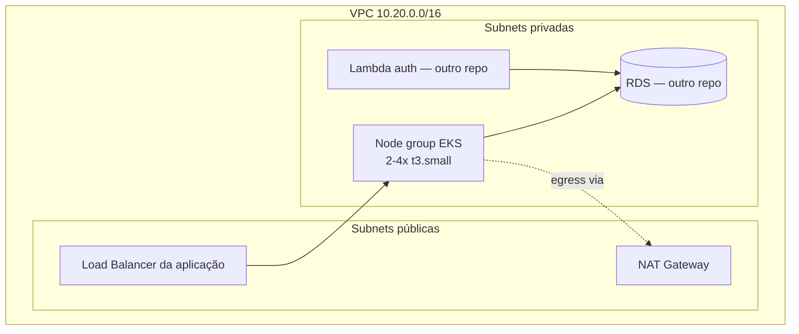

# oficina-infra-k8s

Terraform: VPC + cluster Kubernetes gerenciado (**Amazon EKS**) — repositório 2 de 4 do
Tech Challenge Fase 3. É a base compartilhada: os outros três repositórios
(`oficina-infra-db`, `oficina-lambda-auth`, `oficina-tech-challenge`) leem a VPC/subnets
publicadas aqui via SSM Parameter Store.

## Deploy ativo

Cluster `oficina-eks`, região `us-east-1`, provisionado sob demanda. Se
`aws eks describe-cluster --name oficina-eks` não encontrar o cluster, o ambiente está
desligado — ver "Como aplicar" abaixo para provisionar novamente.

## ⚠️ Custo real

Este repositório provisiona recursos pagos: control plane EKS (~US$ 0,10/h), 1 NAT
Gateway (~US$ 0,045/h + tráfego) e 2x `t3.small` (~US$ 0,0208/h cada, ver
`variables.tf`). Rode `terraform destroy` quando o ambiente não estiver em uso para não
manter custo ocioso.

## Por que EKS

Gerenciado (sem operar o control plane), integra nativamente com IAM/VPC/ELB da AWS.
Análise completa das alternativas em `docs/rfc/` no repositório principal.

## Pré-requisitos

- Conta AWS com credenciais configuradas (`aws configure` ou variáveis de ambiente —
  **nunca** comite credenciais neste repositório).
- Terraform >= 1.5, AWS CLI, `kubectl`.

## Como aplicar

```bash
terraform init
terraform apply
aws eks update-kubeconfig --region us-east-1 --name oficina-eks
kubectl get nodes   # confirma que o cluster está de pé
```

Depois de aplicado, os outros repositórios (`oficina-infra-db`, `oficina-lambda-auth`)
já conseguem ler `/oficina/vpc_id`, `/oficina/private_subnet_ids` etc. via SSM — aplique
este repositório **primeiro**.

## Recursos criados

| Recurso | Descrição |
|---|---|
| `module.vpc` | VPC `10.20.0.0/16`, 2 AZs, subnets públicas + privadas, 1 NAT Gateway |
| `module.eks` | Cluster EKS (versão gerenciada pela AWS — não fixada, ver `variables.tf`), node group gerenciado (2-4x t3.small) |
| `aws_ssm_parameter.*` | Publica VPC id, subnet ids e nome do cluster para os outros repos |

## Diagrama



## Destruir

```bash
terraform destroy
```
